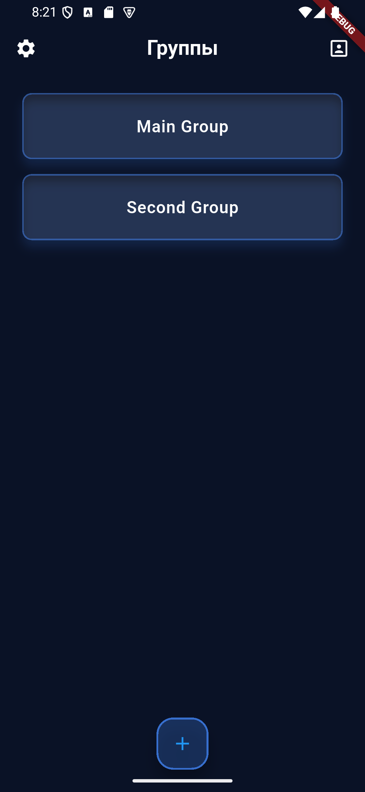
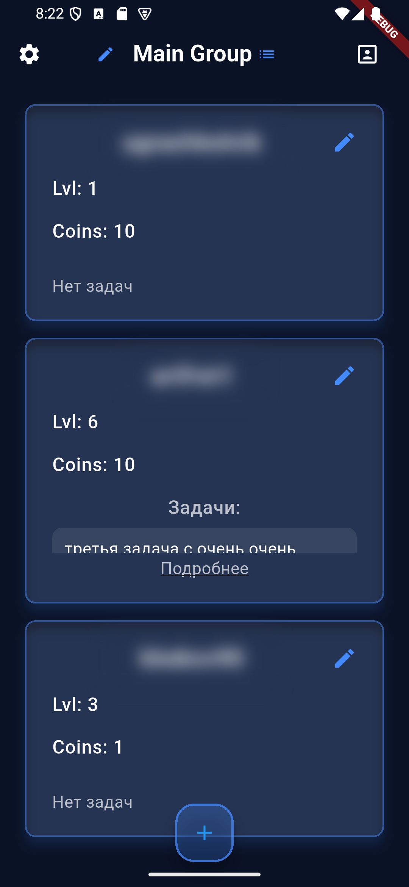
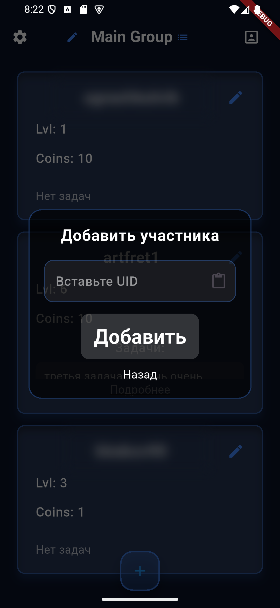
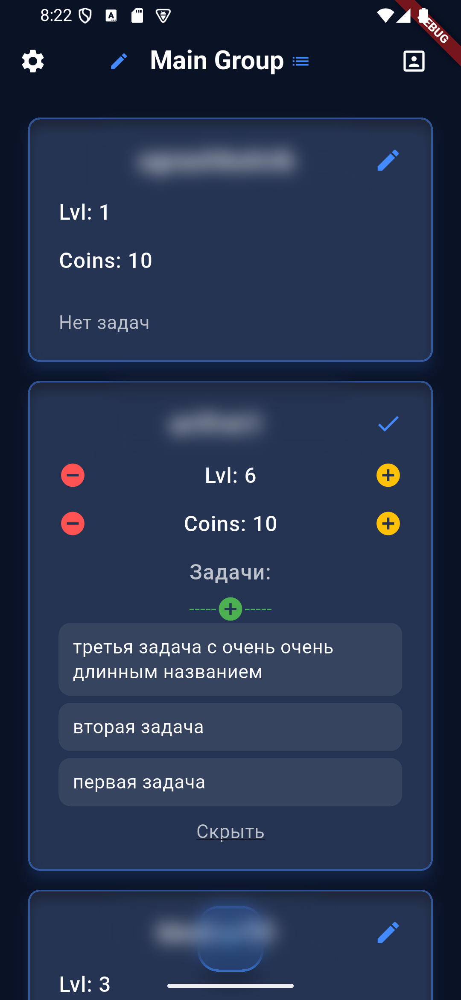
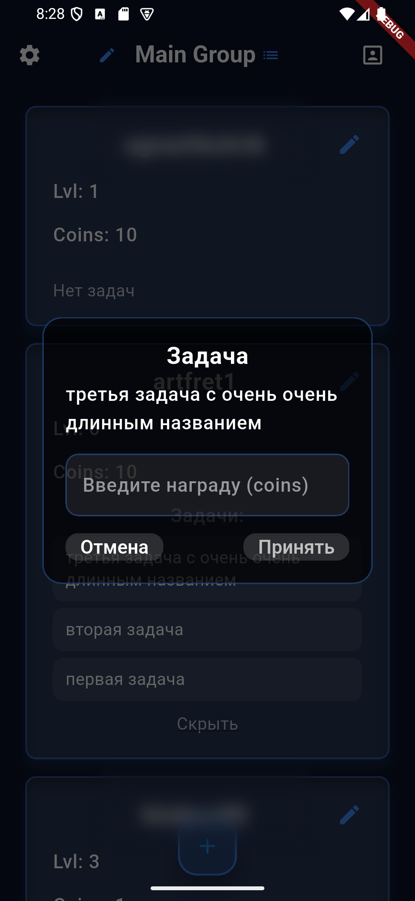
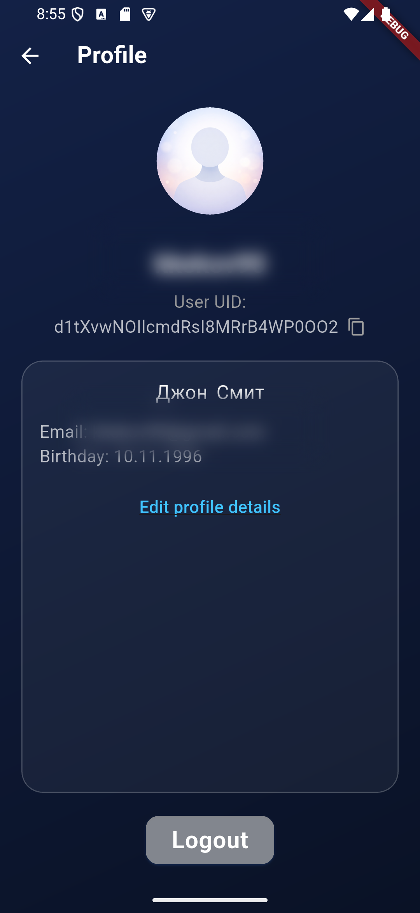

# Task Manager

<div align="center">

Мобильное Flutter-приложение для управления семейными или командными задачами с геймификацией, ролями, группами и синхронизацией через Firebase.

Проект показывает мой подход к построению feature-first архитектуры, разделению ответственности между UI, state management и data layer, а также к проектированию понятного пользовательского сценария от авторизации до управления участниками и задачами.

</div>

## О проекте

Task Manager решает простую, но жизненную задачу: помогает организовать работу внутри небольшой группы, семьи или домашней команды. В приложении можно создавать группы, добавлять участников по UID, назначать им задачи, изменять уровень и количество монет, а также хранить персональные данные профиля.

Ключевая идея проекта не только в CRUD-операциях, а в том, чтобы превратить рутинное распределение задач в понятную и мотивирующую систему с прогрессом, наградами и ролями.

## Что реализовано

- Авторизация через Firebase Authentication: email/password и анонимный вход для быстрого старта.
- Реактивная маршрутизация в зависимости от состояния сессии пользователя.
- Работа с группами: создание, загрузка списка и переименование.
- Разделение ролей внутри группы: администратор и участник.
- Добавление участников в группу по UID.
- Управление прогрессом участников: уровень, монеты, задачи.
- Редактирование задач внутри группы.
- Отдельный экран профиля с редактированием пользовательских данных.
- Настройка темы через Provider.
- Хранение данных в Cloud Firestore.

## Какие навыки демонстрирует проект

- Построение feature-first структуры Flutter-приложения.
- Использование BLoC для изоляции бизнес-логики от UI.
- Применение Repository pattern для работы с Firebase и Firestore.
- Организация нескольких слоев state management под разные задачи: BLoC для бизнес-состояния, Provider для темы, StreamBuilder для auth routing.
- Работа с асинхронностью, состояниями загрузки и обработкой ошибок.
- Проектирование структуры данных в Firestore под многопользовательский сценарий.
- Создание пользовательских flows: регистрация, вход, выбор группы, управление участниками, профиль, настройки.

## Архитектура

Проект построен в стиле feature-first architecture. Код разделен не по типам файлов всего приложения, а по бизнес-областям: auth, groups, family, settings, app. Это делает проект лучше масштабируемым и упрощает развитие новых фич.

### Архитектурные решения

- App layer: инициализация Firebase, подключение провайдеров и глобальных BLoC, роутинг по состоянию пользователя.
- Feature layer: каждая функциональная область содержит собственные screens, bloc, repository, models и widgets.
- Data access: все операции с Firestore инкапсулированы в репозиториях.
- Presentation: экраны не работают с Firebase напрямую, а общаются через BLoC и repository abstraction.

### Используемые паттерны

- BLoC: управление auth-состоянием, группами и семейной логикой.
- Repository pattern: инкапсуляция операций чтения и записи в Firestore.
- Provider: переключение темы приложения.
- GetX navigation: переходы между экранами без перегрузки UI-кода навигацией.

## Логика приложения

### 1. Авторизация

После запуска приложение инициализирует Firebase и проверяет текущую сессию пользователя. Если пользователь уже авторизован, он попадает на экран выбора группы. Если нет, открывается экран входа.

Поддерживаются два сценария:

- вход по email и паролю;
- анонимный вход для быстрого знакомства с приложением.

### 2. Работа с группами

После авторизации пользователь попадает на экран со списком доступных групп. Группа загружается только в том случае, если UID пользователя присутствует в memberIds. При создании новой группы пользователь автоматически становится ее администратором.

Администратор может:

- создать группу;
- переименовать группу;
- управлять составом участников;
- изменять уровень и монеты;
- добавлять и удалять задачи.

### 3. Работа с участниками

На экране группы отображаются карточки участников. Для каждого участника в контексте конкретной группы хранятся:

- уровень;
- монеты;
- список задач.

Редактирование построено через временное состояние внутри FamilyBloc: сначала значения меняются локально в UI-state, а затем сохраняются в Firestore. Это позволяет не дергать базу на каждое нажатие кнопки и упрощает контроль пользовательского сценария.

### 4. Профиль пользователя

Профиль объединяет данные из FirebaseAuth и Cloud Firestore. Базовая информация берется из текущей сессии, а расширенные поля пользователя догружаются из Firestore. Экран поддерживает режим просмотра и редактирования.

### 5. Настройки

Настройки вынесены в отдельный экран. Тема переключается через Provider, что показывает разделение UI-настроек и бизнес-состояния приложения.

## Структура данных в Firestore

Проект использует простую и понятную модель хранения данных:

### Коллекция groups

Каждый документ группы содержит:

- name: название группы;
- memberIds: массив UID участников;
- members: map, где ключом выступает UID, а значением роль пользователя в группе.

### Коллекция users

Каждый документ пользователя хранит:

- name;
- email;
- first_name;
- last_name;
- BirthDay.

### Подколлекция users/{uid}/usersgroups/{groupId}

Внутри конкретной группы для пользователя хранятся:

- lvl;
- coins;
- tasks.

Такая модель позволяет разделить:

- глобальные данные пользователя;
- данные группы;
- прогресс пользователя внутри конкретной группы.

## Стек технологий

- Flutter
- Dart
- Firebase Core
- Firebase Authentication
- Cloud Firestore
- flutter_bloc
- Provider
- GetX
- intl

## Структура проекта

```text
lib/
├── app/
│   ├── firebase_options.dart
│   ├── loading_screen.dart
│   ├── user_router.dart
│   └── theme/
├── features/
│   ├── auth/
│   │   ├── bloc/
│   │   ├── repository/
│   │   └── screens/
│   ├── family/
│   │   ├── bloc/
│   │   ├── models/
│   │   ├── repository/
│   │   ├── screens/
│   │   └── widgets/
│   ├── groups/
│   │   ├── bloc/
│   │   ├── models/
│   │   ├── repository/
│   │   ├── screens/
│   │   └── widgets/
│   └── settings/
│       └── screens/
└── main.dart
```

## Экранный поток

```text
Запуск приложения
		↓
Инициализация Firebase
		↓
Проверка authStateChanges()
		↓
AuthScreen / ChooseGroupScreen
		↓
GroupScreen
		↓
Управление участниками, задачами, наградами и профилем
```

## Скриншоты

<table>
	<tr>
		<td align="center"><strong>Выбор группы</strong></td>
		<td align="center"><strong>Экран группы</strong></td>
		<td align="center"><strong>Добавление задачи</strong></td>
	</tr>
	<tr>
		<td></td>
		<td></td>
		<td></td>
	</tr>
	<tr>
		<td align="center"><strong>Редактирование участника</strong></td>
		<td align="center"><strong>Начисление награды</strong></td>
		<td align="center"><strong>Профиль пользователя</strong></td>
	</tr>
	<tr>
		<td></td>
		<td></td>
		<td></td>
	</tr>
</table>

## Почему этот проект интересен с инженерной точки зрения

Это не просто набор экранов. В проекте есть несколько важных инженерных решений:

- разделение бизнес-логики и UI;
- работа с многопользовательскими данными;
- разграничение ролей внутри группы;
- локальное редактирование состояния перед сохранением;
- понятная и расширяемая структура проекта.

## Запуск проекта

### 1. Установка зависимостей

```bash
flutter pub get
```

### 2. Настройка Firebase

Для запуска потребуется собственный Firebase-проект и корректно настроенные платформенные конфиги.

В проекте уже используются:

- Firebase Authentication
- Cloud Firestore
- firebase_options.dart
- android/app/google-services.json

Для iOS при необходимости нужно дополнительно подключить соответствующий Firebase-конфиг для вашей среды.

### 3. Запуск

```bash
flutter run
```

## Что можно развивать дальше

- push-уведомления о новых задачах и наградах;
- роли с более гибкими правами доступа;
- дедлайны и статусы выполнения задач;
- история действий внутри группы;
- unit и widget tests для ключевой бизнес-логики.

## Итог

Task Manager показывает мой практический навык работы с Flutter не только на уровне интерфейсов, но и на уровне архитектуры, управления состоянием, проектирования данных и интеграции с Firebase.

Если кратко, этот pet-project демонстрирует, что я умею:

- проектировать структуру приложения;
- строить понятные пользовательские сценарии;
- разделять ответственность между слоями;
- работать с backend-as-a-service и состоянием клиента;
- собирать UI, в котором логика не смешана с данными.
